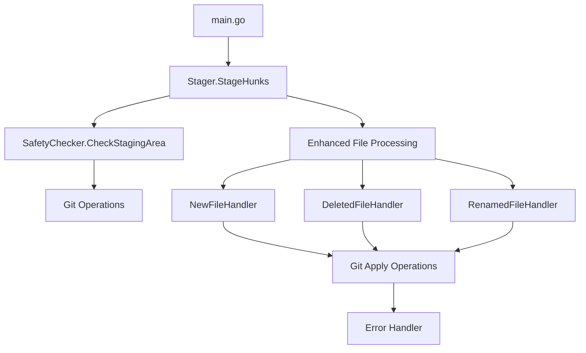
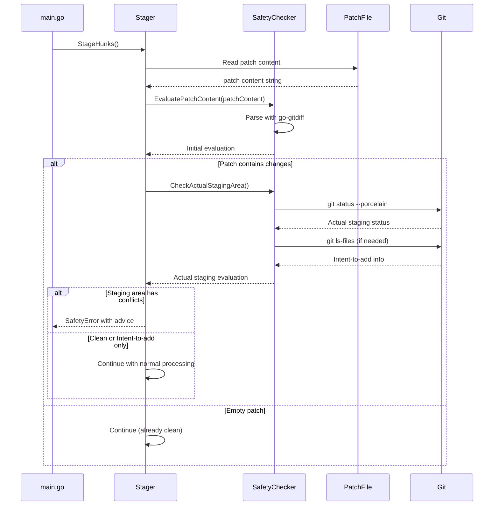
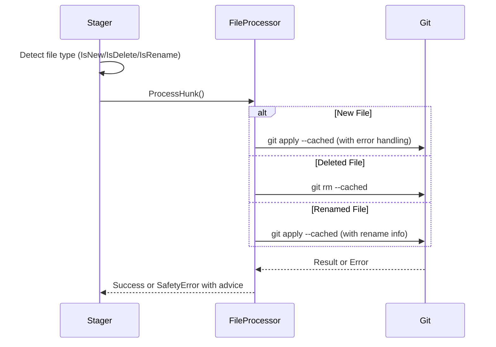

# Safety Improvements - 設計書

## 概要

本設計書は、git-sequential-stageツールの安全性向上機能の技術的実装方針を定義します。[Issue #13](https://github.com/syou6162/git-sequential-stage/issues/13)の要件定義書で特定された6つの要件を満たすため、既存のアーキテクチャを拡張し、新しい安全性チェック機能を統合します。

## アーキテクチャ

### 全体構成



### コンポーネント設計

#### 1. SafetyChecker コンポーネント

**責務:** 安全性チェックを実行（ハイブリッドアプローチ）

**設計方針:**
- 基本的にはパッチファイルの内容から判断する（効率性と保守性を重視）
- パッチファイルの内容から原理的に判断が困難な場合のみ、gitコマンドを実行する
- 具体的には、`git diff HEAD`の出力からはステージング済みかどうか判断できないため、実際のステージングエリアの確認が必要な場合はgitコマンドを使用

**パッチファイルベースのアプローチを優先する理由:**
1. **既存ライブラリの活用**: go-gitdiffライブラリによる堅牢なパッチ解析が利用可能
   - 実績のあるライブラリで、Gitのdiff形式を正確に解析
   - バグが少なく、メンテナンスも活発
2. **パース処理の信頼性**: gitコマンドの出力を自前でパースする場合のリスク回避
   - 自前のパーサーはバグの温床になりやすい
   - Gitのバージョンによる出力形式の違いへの対応が必要
   - エッジケースの処理が複雑
3. **メンテナンス性**: 保守すべきコードの最小化
   - go-gitdiffに処理を委譲することで、自前のパース処理を最小限に
   - 将来的な変更への対応もライブラリ側で吸収される
4. **パフォーマンス**: 多くの場合、パッチファイルの解析だけで十分
   - gitコマンドの実行はプロセス起動のオーバーヘッドがある
   - 必要な場合のみ実行することで、全体的なパフォーマンスを向上

```go
// GitStatusReader is responsible for reading and parsing git status information
type GitStatusReader interface {
    // ReadStatus reads the current git status and returns parsed file information
    ReadStatus() (*GitStatusInfo, error)
}

// GitStatusInfo contains parsed git status information
type GitStatusInfo struct {
    FilesByStatus    map[FileStatus][]string
    StagedFiles      []string
    IntentToAddFiles []string
}

// PatchAnalyzer is responsible for analyzing patch content and extracting file information
type PatchAnalyzer interface {
    // AnalyzePatch analyzes patch content and returns file status information
    AnalyzePatch(patchContent string) (*PatchAnalysisResult, error)
}

// PatchAnalysisResult contains the result of patch analysis
type PatchAnalysisResult struct {
    FilesByStatus    map[FileStatus][]string
    AllFiles         []string
    IntentToAddFiles []string
}

// SafetyChecker - ハイブリッド安全性チェッカー
type SafetyChecker struct {
    statusReader   GitStatusReader
    patchAnalyzer  PatchAnalyzer
}

type StagingAreaEvaluation struct {
    IsClean           bool
    StagedFiles       []string
    IntentToAddFiles  []string  // Intent-to-addファイル (IsNew && len(TextFragments) == 0)
    ErrorMessage      string
    AllowContinue     bool      // intent-to-addのみの場合はtrue
    RecommendedActions []RecommendedAction  // LLM Agent用の推奨アクション
    FilesByStatus     map[FileStatus][]string  // ステータス別ファイルリスト
}

type RecommendedAction struct {
    Description string   // アクションの説明
    Commands    []string // 実行すべきコマンドのリスト
    Priority    int      // 優先度（1が最高）
    Category    string   // "commit", "unstage", "reset" など
}
```

**主要メソッド:**
- `EvaluatePatchContent(patchContent string) (*StagingAreaEvaluation, error)`: パッチ内容からの安全性評価（効率的だが限定的）
- `CheckActualStagingArea() (*StagingAreaEvaluation, error)`: 実際のステージングエリアの状態を確認（正確だがコストが高い）
- `EvaluateWithFallback(patchContent string) (*StagingAreaEvaluation, error)`: ハイブリッドアプローチ（**推奨API**）

#### 2. Enhanced File Processing

**責務:** ファイルタイプ別の適切な処理を実行

```go
type FileProcessor interface {
    CanHandle(hunk *HunkInfo) bool
    ProcessHunk(hunk *HunkInfo, content []byte) error
    GetErrorAdvice(err error) string
}

type NewFileProcessor struct {
    executor executor.CommandExecutor
    logger   *logger.Logger
}

type DeletedFileProcessor struct {
    executor executor.CommandExecutor
    logger   *logger.Logger
}

type RenamedFileProcessor struct {
    executor executor.CommandExecutor
    logger   *logger.Logger
}
```

#### 3. Enhanced Error Handling

**責務:** 統一されたエラーハンドリングと有用なエラーメッセージの提供

```go
type SafetyError struct {
    Type        SafetyErrorType
    Message     string
    Advice      string
    Underlying  error
}

type SafetyErrorType int

const (
    StagingAreaNotClean SafetyErrorType = iota
    NewFileConflict
    DeletedFileConflict
    RenamedFileConflict
    GitOperationFailed
    IntentToAddProcessing  // Intent-to-add処理エラー
)
```

#### 4. Semantic Commit Workflow Integration

**責務:** Intent-to-addファイルの特別処理とワークフロー統合

```go
type IntentToAddHandler struct {
    executor executor.CommandExecutor
    logger   *logger.Logger
}

func (h *IntentToAddHandler) DetectIntentToAddFiles() ([]string, error) {
    // git ls-files --cached --others --exclude-standard を使用
    // intent-to-addファイルを識別
}

func (h *IntentToAddHandler) ProcessIntentToAddHunk(hunk *HunkInfo, content []byte) error {
    // Intent-to-addファイルのハンク処理
    // 通常のgit apply --cachedと同じだが、エラーメッセージを調整
}
```

## 詳細設計

### 1. ステージングエリア保護機能

#### 実装方針（ハイブリッドアプローチ）
- `StageHunks`メソッドの開始時に安全性チェックを実行
- **第1段階**: パッチファイル内容から可能な限り判断（`EvaluatePatchContent`）
  - go-gitdiffライブラリによる詳細解析
  - Intent-to-add検出: `IsNew && len(TextFragments) == 0`
  - ファイルタイプ別（M/A/D/R/C/BINARY）の分類
- **第2段階**: 必要に応じて実際のステージングエリアを確認（`CheckActualStagingArea`）
  - パッチファイルから判断できない場合のみ実行
  - `git status --porcelain`でステージング済みファイルを確認
- **判断基準**:
  - パッチに変更が含まれる場合、実際のステージングエリアの確認が必要
  - パッチが空の場合、パッチベースのチェックで十分
- 各ユースケース（S1.1-S1.8）に対応した専用メッセージを提供

#### コンポーネントの実装

##### GitStatusReader
- `DefaultGitStatusReader`: executor.CommandExecutorを使用してgit statusコマンドを実行
- git status --porcelainの出力を解析し、構造化されたデータに変換
- ステータスコードの解析とintent-to-addファイルの検出を担当

##### PatchAnalyzer
- `DefaultPatchAnalyzer`: go-gitdiffライブラリを使用してパッチを解析
- パッチファイルからファイルの変更状態を抽出
- intent-to-addファイル（新規空ファイル）の検出を担当

##### SafetyChecker
- 上記2つのコンポーネントを組み合わせて安全性チェックを実行
- ハイブリッドアプローチの調整を担当
- エラーメッセージの生成と推奨アクションの構築を担当

#### 実装詳細

```go
func (s *Stager) StageHunks(hunkSpecs []string, patchFile string) error {
    // Phase 0: Safety checks
    if err := s.performSafetyChecks(); err != nil {
        return err
    }

    // 既存の Phase 1, 2 処理...
}

func (s *Stager) performSafetyChecks(patchContent string) error {
    checker := NewSafetyChecker(s.executor)

    // ハイブリッドアプローチ: まずパッチ内容から判断を試みる
    evaluation, err := checker.EvaluatePatchContent(patchContent)
    if err != nil {
        return NewSafetyError(GitOperationFailed,
            "Failed to evaluate patch content safety",
            "Check if the patch content is valid", err)
    }

    // パッチに変更が含まれる場合、実際のステージングエリアの確認が必要
    if len(evaluation.StagedFiles) > 0 {
        // 実際のステージングエリアを確認
        actualEval, err := checker.CheckActualStagingArea()
        if err != nil {
            return err
        }

        // 実際にステージング済みのファイルがある場合
        if !actualEval.IsClean {
            // Intent-to-addファイルのみの場合は警告のみで継続
            if actualEval.AllowContinue {
                s.logger.Info("Intent-to-add files detected (semantic_commit workflow). Continuing...")
                return nil
            }
            return s.generateDetailedStagingError(actualEval)
        }
    }

    return nil
}

func (s *Stager) generateDetailedStagingError(evaluation *StagingAreaEvaluation) error {
    // ファイルタイプ別に分類
    modified := evaluation.FilesByStatus["M"]
    added := evaluation.FilesByStatus["A"]
    deleted := evaluation.FilesByStatus["D"]
    renamed := evaluation.FilesByStatus["R"]
    copied := evaluation.FilesByStatus["C"]

    // 統合エラーメッセージを生成
    message := s.buildStagingErrorMessage(modified, added, deleted, renamed, copied)
    advice := s.buildStagingAdvice(modified, added, deleted, renamed, copied)

    return NewSafetyError(StagingAreaNotClean, message, advice, nil)
}

func (s *Stager) buildRecommendedActions(modified, added, deleted, renamed, copied, intentToAdd []string) []RecommendedAction {
    var actions []RecommendedAction

    // Intent-to-addファイルの場合は情報提供のみ
    if len(intentToAdd) > 0 {
        actions = append(actions, RecommendedAction{
            Description: "Intent-to-add files detected (semantic_commit workflow)",
            Commands:    []string{"# These files will be processed normally"},
            Priority:    1,
            Category:    "info",
        })
    }

    // 削除ファイルがある場合の推奨アクション
    if len(deleted) > 0 {
        for _, file := range deleted {
            actions = append(actions, RecommendedAction{
                Description: fmt.Sprintf("Commit deletion of %s", file),
                Commands:    []string{fmt.Sprintf("git commit -m \"Remove %s\"", file)},
                Priority:    1,
                Category:    "commit",
            })
            actions = append(actions, RecommendedAction{
                Description: fmt.Sprintf("Restore deleted file %s", file),
                Commands:    []string{fmt.Sprintf("git reset HEAD %s", file)},
                Priority:    2,
                Category:    "restore",
            })
        }
    }

    // 修正・追加・リネーム・コピーファイルの推奨アクション
    if len(modified) > 0 || (len(added) > 0 && len(intentToAdd) == 0) || len(renamed) > 0 || len(copied) > 0 {
        // 全体コミット
        actions = append(actions, RecommendedAction{
            Description: "Commit all staged changes",
            Commands:    []string{"git commit -m \"Your commit message\""},
            Priority:    1,
            Category:    "commit",
        })

        // 全体アンステージ
        actions = append(actions, RecommendedAction{
            Description: "Unstage all changes",
            Commands:    []string{"git reset HEAD"},
            Priority:    2,
            Category:    "unstage",
        })

        // ファイル別アンステージ
        allFiles := append(append(append(modified, added...), renamed...), copied...)
        for _, file := range allFiles {
            if !contains(intentToAdd, file) { // intent-to-addファイルは除外
                actions = append(actions, RecommendedAction{
                    Description: fmt.Sprintf("Unstage specific file %s", file),
                    Commands:    []string{fmt.Sprintf("git reset HEAD %s", file)},
                    Priority:    3,
                    Category:    "unstage",
                })
            }
        }
    }

    return actions
}

func (s *Stager) buildStagingAdvice(actions []RecommendedAction) string {
    var advice strings.Builder

    // 優先度順にソート
    sort.Slice(actions, func(i, j int) bool {
        return actions[i].Priority < actions[j].Priority
    })

    // カテゴリ別にグループ化して表示
    categories := make(map[string][]RecommendedAction)
    for _, action := range actions {
        categories[action.Category] = append(categories[action.Category], action)
    }

    // 情報提供
    if infoActions, exists := categories["info"]; exists {
        advice.WriteString("Information:\n")
        for _, action := range infoActions {
            advice.WriteString(fmt.Sprintf("  - %s\n", action.Description))
        }
        advice.WriteString("\n")
    }

    // コミット推奨
    if commitActions, exists := categories["commit"]; exists {
        advice.WriteString("Recommended: Commit changes first\n")
        for _, action := range commitActions {
            advice.WriteString(fmt.Sprintf("  %s\n", action.Commands[0]))
        }
        advice.WriteString("\n")
    }

    // アンステージ代替案
    if unstageActions, exists := categories["unstage"]; exists {
        advice.WriteString("Alternative: Unstage changes\n")
        for _, action := range unstageActions {
            advice.WriteString(fmt.Sprintf("  %s\n", action.Commands[0]))
        }
        advice.WriteString("\n")
    }

    // 復元オプション
    if restoreActions, exists := categories["restore"]; exists {
        advice.WriteString("Restore options:\n")
        for _, action := range restoreActions {
            advice.WriteString(fmt.Sprintf("  %s\n", action.Commands[0]))
        }
        advice.WriteString("\n")
    }

    advice.WriteString("Note: File deletions should ideally be committed separately.")

    return advice.String()
}

// Semantic Commit Workflow完全サポート
func (s *Stager) StageHunksWithSemanticCommitSupport(hunkSpecs []string, patchFile string) error {
    // Phase 0: 安全性チェック（Intent-to-add対応）
    if err := s.performSafetyChecksWithSemanticCommit(); err != nil {
        return err
    }

    // 既存のStageHunks処理...
    return s.StageHunks(hunkSpecs, patchFile)
}

func (s *Stager) performSafetyChecksWithSemanticCommit(patchContent string) error {
    checker := NewSafetyChecker()  // 引数不要
    evaluation, err := checker.EvaluatePatchContent(patchContent)
    if err != nil {
        return NewSafetyError(GitOperationFailed,
            "Failed to evaluate patch content safety",
            "Check if the patch content is valid", err)
    }

    // Intent-to-addファイルのみの場合は警告で継続
    if evaluation.AllowContinue {
        s.logger.Info("Semantic commit workflow detected: Intent-to-add files found")
        s.logger.Info("Files: %v", evaluation.IntentToAddFiles)
        return nil
    }

    if !evaluation.IsClean {
        return s.generateDetailedStagingError(evaluation)
    }

    return nil
}
```

### 2. 新規ファイル処理の改善

#### 実装方針
- `extractHunkContent`で新規ファイルを検出時、専用の処理パスを使用
- 既にステージング済みの新規ファイルに対する適切なエラーハンドリング
- `git apply --cached`の"already exists in index"エラーの捕捉と変換

#### 実装詳細

```go
func (s *Stager) applyHunk(hunkContent []byte, targetID string, hunk *HunkInfo) error {
    if hunk.File != nil && hunk.File.IsNew {
        return s.applyNewFileHunk(hunkContent, targetID, hunk)
    }

    // 既存の処理...
}

func (s *Stager) applyNewFileHunk(hunkContent []byte, targetID string, hunk *HunkInfo) error {
    _, err := s.executor.ExecuteWithStdin("git", bytes.NewReader(hunkContent), "apply", "--cached")
    if err != nil {
        if strings.Contains(err.Error(), "already exists in index") {
            return NewSafetyError(NewFileConflict,
                fmt.Sprintf("New file %s is already staged", hunk.FilePath),
                fmt.Sprintf("Run 'git reset HEAD %s' to unstage the file first", hunk.FilePath),
                err)
        }
        return NewPatchApplicationError(targetID, err)
    }
    return nil
}
```

### 3. 削除ファイル処理の改善

#### 実装方針
- 削除ファイルの検出時、`git rm --cached`相当の処理を実行
- 既に削除済みファイルに対する適切なエラーハンドリング

#### 実装詳細

```go
func (s *Stager) applyDeletedFileHunk(hunkContent []byte, targetID string, hunk *HunkInfo) error {
    // 削除ファイルの場合、git rmを使用
    _, err := s.executor.Execute("git", "rm", "--cached", hunk.FilePath)
    if err != nil {
        if strings.Contains(err.Error(), "did not match any files") {
            return NewSafetyError(DeletedFileConflict,
                fmt.Sprintf("File %s is already deleted", hunk.FilePath),
                "The file has already been removed from the index",
                err)
        }
        return NewGitCommandError("git rm", err)
    }
    return nil
}
```

### 4. リネームファイル処理の改善

#### 実装方針
- リネームファイルのパッチID計算時、新旧両方のファイル名で照合
- リネーム情報を含む適切なパッチ生成の確保

#### 実装詳細

```go
func (s *Stager) findMatchingRenamedHunk(currentHunks []HunkInfo, targetIDs []string) (*HunkInfo, string, bool) {
    for _, hunk := range currentHunks {
        if hunk.File != nil && hunk.File.IsRename {
            // 新旧両方のファイル名でパッチID照合を試行
            for _, targetID := range targetIDs {
                if s.matchesRenamedFile(&hunk, targetID) {
                    return &hunk, targetID, true
                }
            }
        }
    }
    return nil, "", false
}

func (s *Stager) matchesRenamedFile(hunk *HunkInfo, targetID string) bool {
    // 現在のファイル名でのパッチID計算
    if currentID := s.calculatePatchIDForHunk(hunk); currentID == targetID {
        return true
    }

    // 旧ファイル名でのパッチID計算も試行
    if oldID := s.calculatePatchIDWithOldName(hunk); oldID == targetID {
        return true
    }

    return false
}
```

### 5. エラーハンドリングの統一化

#### 実装方針
- 新しい`SafetyError`タイプで統一されたエラー情報を提供
- エラータイプ別の適切な対処法を含む
- 既存のエラータイプシステムとの統合

#### 実装詳細

```go
func NewSafetyError(errorType SafetyErrorType, message, advice string, underlying error) *SafetyError {
    return &SafetyError{
        Type:       errorType,
        Message:    message,
        Advice:     advice,
        Underlying: underlying,
    }
}

func (e *SafetyError) Error() string {
    var result strings.Builder
    result.WriteString(fmt.Sprintf("Safety Error: %s", e.Message))

    if e.Advice != "" {
        result.WriteString(fmt.Sprintf("\nAdvice: %s", e.Advice))
    }

    if e.Underlying != nil {
        result.WriteString(fmt.Sprintf("\nUnderlying error: %v", e.Underlying))
    }

    return result.String()
}
```

## データフロー

### 1. 安全性チェックフロー（ハイブリッドアプローチ）



### 2. ファイルタイプ別処理フロー



## テスト戦略

### 1. ユニットテスト

- `SafetyChecker`の各メソッドのテスト
- ファイルタイプ別処理の各パスのテスト
- エラーハンドリングの各ケースのテスト
- モックを使用した依存関係の分離

### 2. 統合テスト

- 実際のGitリポジトリでの安全性チェックのテスト
- ファイルタイプ別処理の実際のGit操作テスト
- エラーシナリオの実際の動作テスト

### 3. E2Eテスト

- Issue #13で特定された問題シナリオの再現テスト
- 複雑なGit状態での安全性機能のテスト
- パフォーマンス要件の検証テスト

## 実装順序

### Phase 1: 基盤実装
1. `SafetyChecker`コンポーネントの実装
2. `SafetyError`タイプの実装
3. ステージングエリア保護機能の実装

### Phase 2: ファイル処理改善
1. 新規ファイル処理の改善
2. 削除ファイル処理の改善
3. リネームファイル処理の改善

### Phase 3: 統合とテスト
1. 既存コードとの統合
2. 包括的なテストの実装
3. パフォーマンス最適化

## 設定オプション

### 環境変数
- `GIT_SEQUENTIAL_STAGE_VERBOSE`: 詳細ログの有効化

### 設計方針
- **安全性最優先**: 互換性よりも安全性を重視
- **ユーザーフレンドリー**: 分かりやすいエラーメッセージと対処法
- **シンプルな実装**: 複雑な互換性維持コードを避ける
- **ハイブリッドアプローチ**: 効率性と正確性のバランス
  - 基本的にはパッチファイルベースで判断（高速）
  - 必要な場合のみgitコマンドを実行（正確）
  - パフォーマンスと正確性の最適なトレードオフ

### 将来の拡張性
- 設定ファイルによる安全性チェックのカスタマイズ
- プロジェクト固有の安全性ルールの定義
