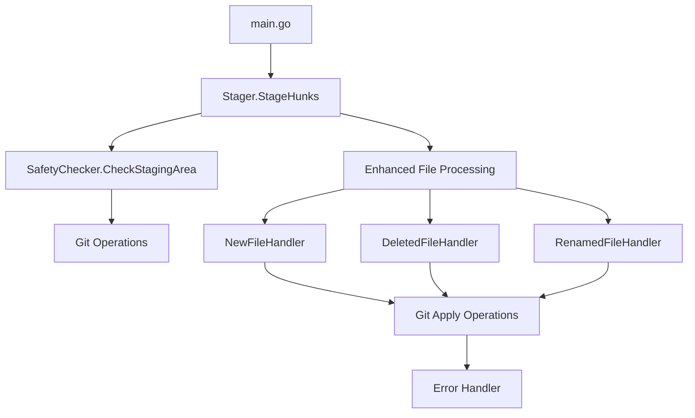
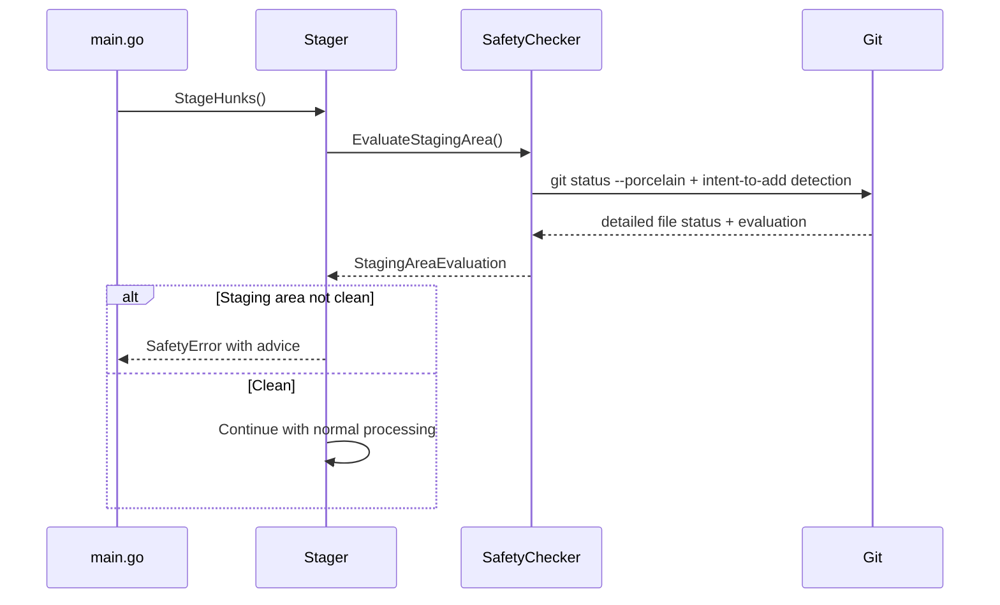
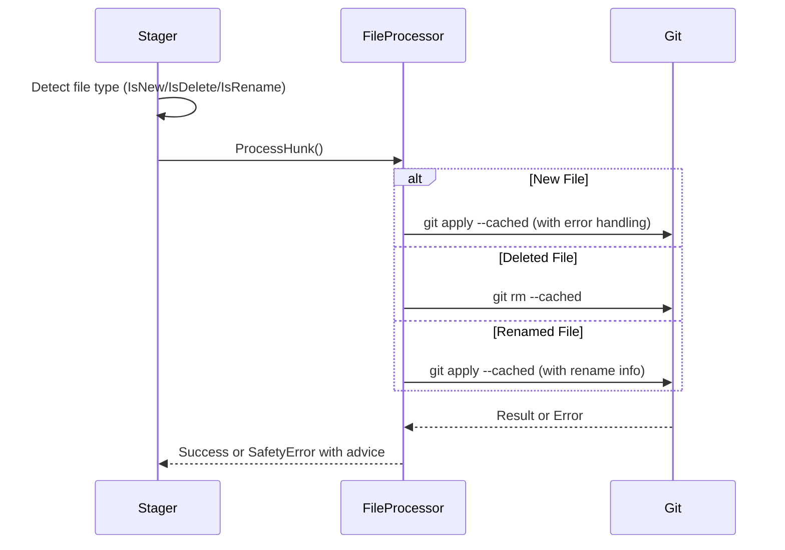

# Safety Improvements - 設計書

## 概要

本設計書は、git-sequential-stageツールの安全性向上機能の技術的実装方針を定義します。[Issue #13](https://github.com/syou6162/git-sequential-stage/issues/13)の要件定義書で特定された6つの要件を満たすため、既存のアーキテクチャを拡張し、新しい安全性チェック機能を統合します。

## アーキテクチャ

### 全体構成



### コンポーネント設計

#### 1. SafetyChecker コンポーネント

**責務:** ツール実行前の安全性チェックを実行

```go
type SafetyChecker struct {
    executor executor.CommandExecutor
    logger   *logger.Logger
}

type StagingAreaEvaluation struct {
    IsClean           bool
    StagedFiles       []string
    IntentToAddFiles  []string  // git add -N されたファイル
    ErrorMessage      string
    AllowContinue     bool      // intent-to-addのみの場合はtrue
    RecommendedActions []RecommendedAction  // LLM Agent用の推奨アクション
    FilesByStatus     map[string][]string  // ステータス別ファイルリスト
}

type RecommendedAction struct {
    Description string   // アクションの説明
    Commands    []string // 実行すべきコマンドのリスト
    Priority    int      // 優先度（1が最高）
    Category    string   // "commit", "unstage", "reset" など
}
```

**主要メソッド:**
- `EvaluateStagingArea() (*StagingAreaEvaluation, error)`: ステージングエリアの安全性評価を実行
- `ValidateGitState() error`: Git リポジトリの基本状態を検証

#### 2. Enhanced File Processing

**責務:** ファイルタイプ別の適切な処理を実行

```go
type FileProcessor interface {
    CanHandle(hunk *HunkInfo) bool
    ProcessHunk(hunk *HunkInfo, content []byte) error
    GetErrorAdvice(err error) string
}

type NewFileProcessor struct {
    executor executor.CommandExecutor
    logger   *logger.Logger
}

type DeletedFileProcessor struct {
    executor executor.CommandExecutor
    logger   *logger.Logger
}

type RenamedFileProcessor struct {
    executor executor.CommandExecutor
    logger   *logger.Logger
}
```

#### 3. Enhanced Error Handling

**責務:** 統一されたエラーハンドリングと有用なエラーメッセージの提供

```go
type SafetyError struct {
    Type        SafetyErrorType
    Message     string
    Advice      string
    Underlying  error
    Context     map[string]interface{}
}

type SafetyErrorType int

const (
    ErrorTypeStagingAreaNotClean SafetyErrorType = iota
    ErrorTypeNewFileConflict
    ErrorTypeDeletedFileConflict
    ErrorTypeRenamedFileConflict
    ErrorTypeGitOperationFailed
    ErrorTypeIntentToAddProcessing  // Intent-to-add処理エラー
)
```

#### 4. Semantic Commit Workflow Integration

**責務:** Intent-to-addファイルの特別処理とワークフロー統合

```go
type IntentToAddHandler struct {
    executor executor.CommandExecutor
    logger   *logger.Logger
}

func (h *IntentToAddHandler) DetectIntentToAddFiles() ([]string, error) {
    // git ls-files --cached --others --exclude-standard を使用
    // intent-to-addファイルを識別
}

func (h *IntentToAddHandler) ProcessIntentToAddHunk(hunk *HunkInfo, content []byte) error {
    // Intent-to-addファイルのハンク処理
    // 通常のgit apply --cachedと同じだが、エラーメッセージを調整
}
```

## 詳細設計

### 1. ステージングエリア保護機能

#### 実装方針
- `StageHunks`メソッドの開始時に`SafetyChecker.CheckStagingArea()`を呼び出し
- `git status --porcelain`でステージング済みファイルの詳細状態を取得
- ファイルタイプ別（M/A/D/R/C）に分類して詳細なエラーメッセージと対処法を表示
- **Intent-to-add (git add -N) ファイルの特別扱い**: semantic_commitワークフロー対応
- 各ユースケース（S1.1-S1.8）に対応した専用メッセージを提供

#### 実装詳細

```go
func (s *Stager) StageHunks(hunkSpecs []string, patchFile string) error {
    // Phase 0: Safety checks
    if err := s.performSafetyChecks(); err != nil {
        return err
    }
    
    // 既存の Phase 1, 2 処理...
}

func (s *Stager) performSafetyChecks() error {
    checker := NewSafetyChecker(s.executor)
    evaluation, err := checker.EvaluateStagingArea()
    if err != nil {
        return NewSafetyError(ErrorTypeGitOperationFailed, 
            "Failed to evaluate staging area safety", 
            "Ensure you are in a valid Git repository", err)
    }
    
    if !evaluation.IsClean {
        // Intent-to-addファイルのみの場合は警告のみで継続
        if evaluation.AllowContinue {
            s.logger.Info("Intent-to-add files detected (semantic_commit workflow). Continuing...")
            return nil
        }
        return s.generateDetailedStagingError(evaluation)
    }
    
    return nil
}

func (s *Stager) generateDetailedStagingError(evaluation *StagingAreaEvaluation) error {
    // ファイルタイプ別に分類
    modified := evaluation.FilesByStatus["M"]
    added := evaluation.FilesByStatus["A"] 
    deleted := evaluation.FilesByStatus["D"]
    renamed := evaluation.FilesByStatus["R"]
    copied := evaluation.FilesByStatus["C"]
    
    // 統合エラーメッセージを生成
    message := s.buildStagingErrorMessage(modified, added, deleted, renamed, copied)
    advice := s.buildStagingAdvice(modified, added, deleted, renamed, copied)
    
    return NewSafetyError(ErrorTypeStagingAreaNotClean, message, advice, nil)
}

func (s *Stager) buildStagingAdvice(modified, added, deleted, renamed, copied []string, intentToAdd []string) string {
    var advice strings.Builder
    
    // Intent-to-addファイルの説明
    if len(intentToAdd) > 0 {
        advice.WriteString("Intent-to-add files (semantic_commit workflow):\n")
        advice.WriteString("  - These files will be processed normally\n")
        advice.WriteString("  - Part of semantic_commit workflow (git add -N)\n\n")
    }
    
    // 削除ファイルがある場合は特別な推奨事項
    if len(deleted) > 0 {
        advice.WriteString("For deleted files:\n")
        advice.WriteString("  - Commit deletion: git commit -m \"Remove <filename>\"\n")
        advice.WriteString("  - (Alternative) Restore file: git reset HEAD <file>\n\n")
    }
    
    // その他のファイルの対処法
    if len(modified) > 0 || (len(added) > 0 && len(intentToAdd) == 0) || len(renamed) > 0 || len(copied) > 0 {
        advice.WriteString("For other changes:\n")
        advice.WriteString("  - Commit all changes: git commit -m \"Your commit message\"\n")
        advice.WriteString("  - Unstage all changes: git reset HEAD\n")
        advice.WriteString("  - Unstage specific files: git reset HEAD <file>\n\n")
    }
    
    advice.WriteString("Note: File deletions should ideally be committed separately.")
    
    return advice.String()
}

// Semantic Commit Workflow完全サポート
func (s *Stager) StageHunksWithSemanticCommitSupport(hunkSpecs []string, patchFile string) error {
    // Phase 0: 安全性チェック（Intent-to-add対応）
    if err := s.performSafetyChecksWithSemanticCommit(); err != nil {
        return err
    }
    
    // 既存のStageHunks処理...
    return s.StageHunks(hunkSpecs, patchFile)
}

func (s *Stager) performSafetyChecksWithSemanticCommit() error {
    checker := NewSafetyChecker(s.executor)
    evaluation, err := checker.EvaluateStagingArea()
    if err != nil {
        return NewSafetyError(ErrorTypeGitOperationFailed, 
            "Failed to evaluate staging area safety", 
            "Ensure you are in a valid Git repository", err)
    }
    
    // Intent-to-addファイルのみの場合は警告で継続
    if evaluation.AllowContinue {
        s.logger.Info("Semantic commit workflow detected: Intent-to-add files found")
        s.logger.Info("Files: %v", evaluation.IntentToAddFiles)
        return nil
    }
    
    if !evaluation.IsClean {
        return s.generateDetailedStagingError(evaluation)
    }
    
    return nil
}
```

### 2. 新規ファイル処理の改善

#### 実装方針
- `extractHunkContent`で新規ファイルを検出時、専用の処理パスを使用
- 既にステージング済みの新規ファイルに対する適切なエラーハンドリング
- `git apply --cached`の"already exists in index"エラーの捕捉と変換

#### 実装詳細

```go
func (s *Stager) applyHunk(hunkContent []byte, targetID string, hunk *HunkInfo) error {
    if hunk.File != nil && hunk.File.IsNew {
        return s.applyNewFileHunk(hunkContent, targetID, hunk)
    }
    
    // 既存の処理...
}

func (s *Stager) applyNewFileHunk(hunkContent []byte, targetID string, hunk *HunkInfo) error {
    _, err := s.executor.ExecuteWithStdin("git", bytes.NewReader(hunkContent), "apply", "--cached")
    if err != nil {
        if strings.Contains(err.Error(), "already exists in index") {
            return NewSafetyError(ErrorTypeNewFileConflict,
                fmt.Sprintf("New file %s is already staged", hunk.FilePath),
                fmt.Sprintf("Run 'git reset HEAD %s' to unstage the file first", hunk.FilePath),
                err)
        }
        return NewPatchApplicationError(targetID, err)
    }
    return nil
}
```

### 3. 削除ファイル処理の改善

#### 実装方針
- 削除ファイルの検出時、`git rm --cached`相当の処理を実行
- 既に削除済みファイルに対する適切なエラーハンドリング

#### 実装詳細

```go
func (s *Stager) applyDeletedFileHunk(hunkContent []byte, targetID string, hunk *HunkInfo) error {
    // 削除ファイルの場合、git rmを使用
    _, err := s.executor.Execute("git", "rm", "--cached", hunk.FilePath)
    if err != nil {
        if strings.Contains(err.Error(), "did not match any files") {
            return NewSafetyError(ErrorTypeDeletedFileConflict,
                fmt.Sprintf("File %s is already deleted", hunk.FilePath),
                "The file has already been removed from the index",
                err)
        }
        return NewGitCommandError("git rm", err)
    }
    return nil
}
```

### 4. リネームファイル処理の改善

#### 実装方針
- リネームファイルのパッチID計算時、新旧両方のファイル名で照合
- リネーム情報を含む適切なパッチ生成の確保

#### 実装詳細

```go
func (s *Stager) findMatchingRenamedHunk(currentHunks []HunkInfo, targetIDs []string) (*HunkInfo, string, bool) {
    for _, hunk := range currentHunks {
        if hunk.File != nil && hunk.File.IsRename {
            // 新旧両方のファイル名でパッチID照合を試行
            for _, targetID := range targetIDs {
                if s.matchesRenamedFile(&hunk, targetID) {
                    return &hunk, targetID, true
                }
            }
        }
    }
    return nil, "", false
}

func (s *Stager) matchesRenamedFile(hunk *HunkInfo, targetID string) bool {
    // 現在のファイル名でのパッチID計算
    if currentID := s.calculatePatchIDForHunk(hunk); currentID == targetID {
        return true
    }
    
    // 旧ファイル名でのパッチID計算も試行
    if oldID := s.calculatePatchIDWithOldName(hunk); oldID == targetID {
        return true
    }
    
    return false
}
```

### 5. エラーハンドリングの統一化

#### 実装方針
- 新しい`SafetyError`タイプで統一されたエラー情報を提供
- エラータイプ別の適切な対処法を含む
- 既存のエラータイプシステムとの統合

#### 実装詳細

```go
func NewSafetyError(errorType SafetyErrorType, message, advice string, underlying error) *SafetyError {
    return &SafetyError{
        Type:       errorType,
        Message:    message,
        Advice:     advice,
        Underlying: underlying,
        Context:    make(map[string]interface{}),
    }
}

func (e *SafetyError) Error() string {
    var result strings.Builder
    result.WriteString(fmt.Sprintf("Safety Error: %s", e.Message))
    
    if e.Advice != "" {
        result.WriteString(fmt.Sprintf("\nAdvice: %s", e.Advice))
    }
    
    if e.Underlying != nil {
        result.WriteString(fmt.Sprintf("\nUnderlying error: %v", e.Underlying))
    }
    
    return result.String()
}
```

## データフロー

### 1. 安全性チェックフロー



### 2. ファイルタイプ別処理フロー



## テスト戦略

### 1. ユニットテスト

- `SafetyChecker`の各メソッドのテスト
- ファイルタイプ別処理の各パスのテスト
- エラーハンドリングの各ケースのテスト
- モックを使用した依存関係の分離

### 2. 統合テスト

- 実際のGitリポジトリでの安全性チェックのテスト
- ファイルタイプ別処理の実際のGit操作テスト
- エラーシナリオの実際の動作テスト

### 3. E2Eテスト

- Issue #13で特定された問題シナリオの再現テスト
- 複雑なGit状態での安全性機能のテスト
- パフォーマンス要件の検証テスト

## 実装順序

### Phase 1: 基盤実装
1. `SafetyChecker`コンポーネントの実装
2. `SafetyError`タイプの実装
3. ステージングエリア保護機能の実装

### Phase 2: ファイル処理改善
1. 新規ファイル処理の改善
2. 削除ファイル処理の改善
3. リネームファイル処理の改善

### Phase 3: 統合とテスト
1. 既存コードとの統合
2. 包括的なテストの実装
3. パフォーマンス最適化

## 設定オプション

### 環境変数
- `GIT_SEQUENTIAL_STAGE_VERBOSE`: 詳細ログの有効化

### 設計方針
- **安全性最優先**: 互換性よりも安全性を重視
- **ユーザーフレンドリー**: 分かりやすいエラーメッセージと対処法
- **シンプルな実装**: 複雑な互換性維持コードを避ける

### 将来の拡張性
- 設定ファイルによる安全性チェックのカスタマイズ
- プロジェクト固有の安全性ルールの定義